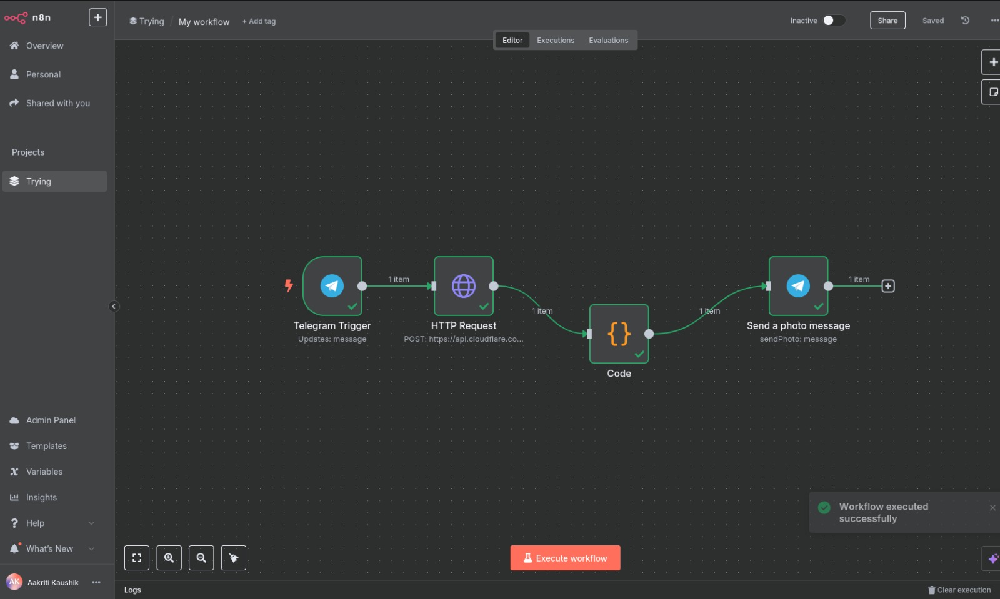

# RageImaginesBot 

A powerful Telegram bot that transforms your text descriptions into stunning AI-generated images using Cloudflare Workers AI and n8n automation.

## 🌟 Features

### 🎯 Text-to-Image Generation
Transform your creative ideas into visual masterpieces! Simply send a text prompt like "A futuristic city at night" and watch as the bot generates corresponding images using Cloudflare Workers AI's Stable Diffusion XL model.

### ⚡ Real-Time Image Delivery
Experience instant gratification with immediate image delivery. The bot processes your request, generates the image, and sends it directly to your Telegram chat in real-time through seamless binary data conversion and upload handling.

### 🎮 Dynamic Chat Integration
Fully interactive and user-specific responses! The bot intelligently retrieves Chat IDs from Telegram triggers to ensure your generated images are delivered to the exact chat where you made the request.

### 💰 Free Tier Compatibility
Built with accessibility in mind, RageImaginesBot operates within Cloudflare Workers AI's generous free tier (10,000 neurons/day ≈ 20-30 images), making it perfect for experimentation, learning, and testing without any costs.

### 🎨 Customizable Prompt Processing
Unleash your creativity with flexible prompt processing that accepts any text input directly from your Telegram messages. Experiment with various descriptions, styles, and creative concepts.

### 🛡️ Error Handling Ready
While currently in development, the bot's architecture supports robust error handling implementation to notify users of any generation failures, ensuring a smooth user experience.

## 🚀 How It Works

1. **Send a Prompt**: Message the bot with your creative text description
2. **AI Processing**: The bot forwards your prompt to Cloudflare Workers AI's Stable Diffusion XL
3. **Image Generation**: Advanced AI algorithms transform your text into a unique image
4. **Instant Delivery**: The generated image is immediately sent back to your Telegram chat

## 🔧 Technical Architecture

- **Platform**: n8n automation workflow
- **AI Engine**: Cloudflare Workers AI (Stable Diffusion XL)
- **Messaging**: Telegram Bot API
- **Data Handling**: JavaScript for binary data conversion
- **Deployment**: Serverless architecture

### Workflow Components:
1. **Telegram Trigger**: Receives user messages and prompts
2. **HTTP Request**: Sends prompts to Cloudflare Workers AI API
3. **Code Node**: Handles binary data conversion for image processing
4. **Send Photo Message**: Delivers generated images back to Telegram chat

## 📊 Usage Limits

- **Free Tier**: 10,000 neurons per day
- **Approximate Images**: 20-30 images per day
- **Cost**: Completely free within limits

## 🎯 Perfect For

- Creative professionals and artists
- Content creators and marketers
- Students learning about AI
- Hobbyists exploring image generation
- Anyone wanting to bring text ideas to life

## 🛠️ Current Status

The bot is fully functional with core features implemented. Future enhancements may include:
- Multiple image output options
- Style customization parameters
- Rate limit notifications
- Enhanced error handling
- Prompt suggestion features

## 🎨 Example Prompts

Try these creative prompts to get started:
- "A magical forest with glowing mushrooms"
- "Cyberpunk street scene with neon lights"
- "Abstract geometric patterns in vibrant colors"
- "A serene mountain landscape at sunset"
- "Steampunk airship flying through clouds"

## 🤝 Contributing

This project showcases the power of combining n8n automation with AI image generation. Feel free to explore, experiment, and build upon this foundation!

## 📝 License

This project is open for educational and experimental use.

---

**Ready to bring your imagination to life? Start chatting with RageImaginesBot today!** 🚀✨
